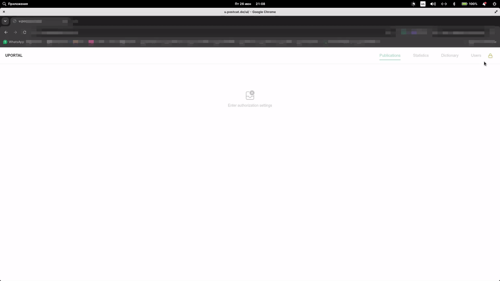
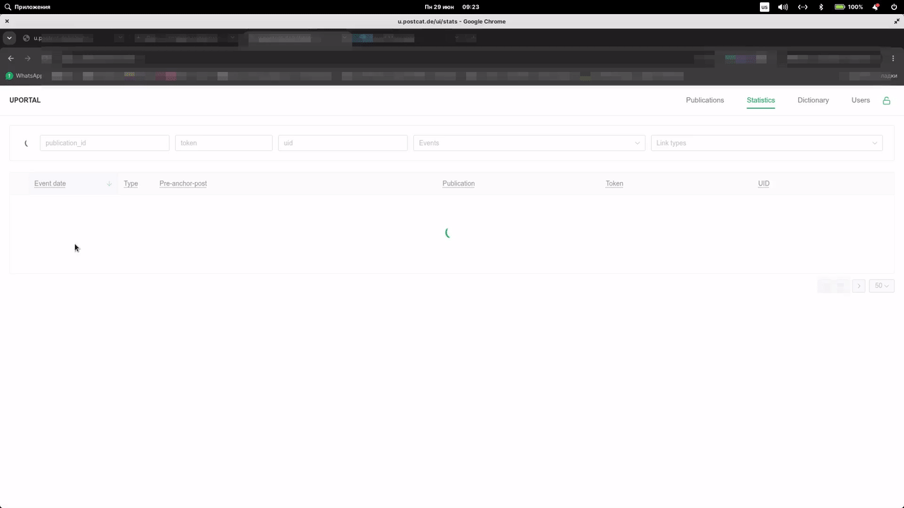
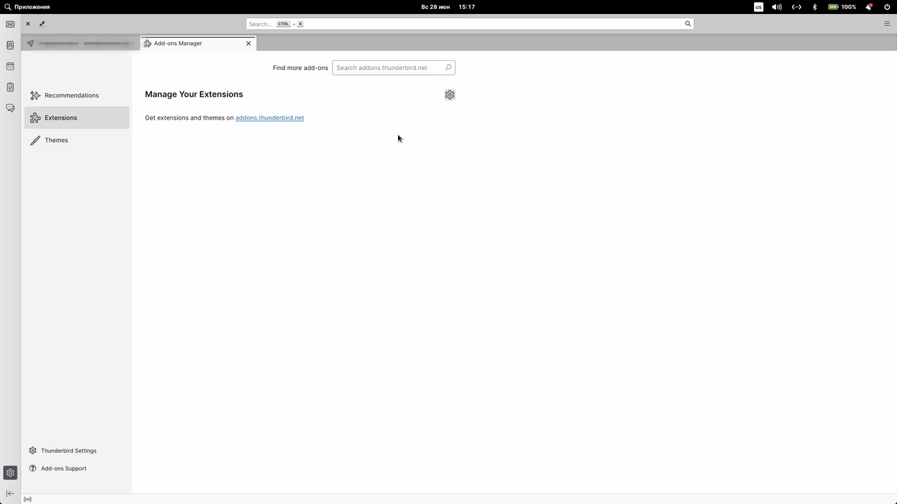
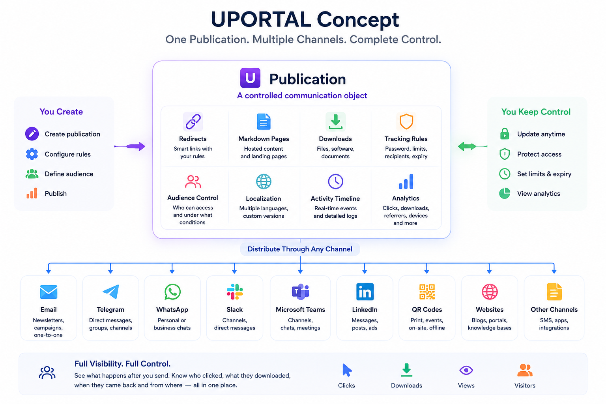
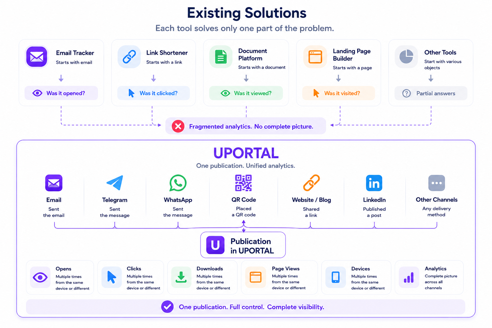
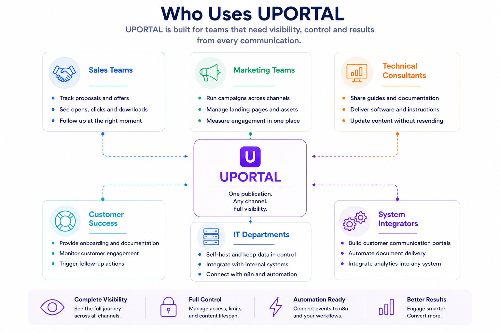
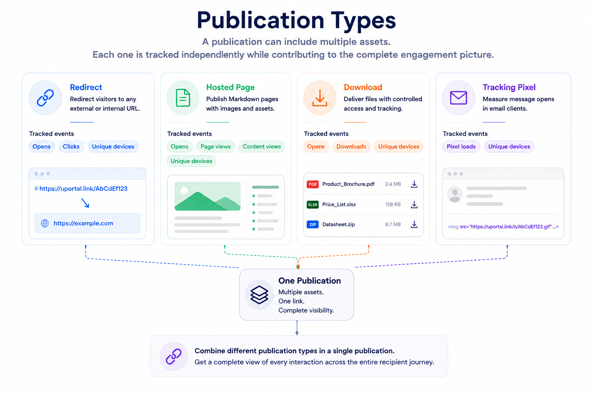

<p align="center">
  
</p>

# UPORTAL: Open-Source Self-Hosted Email Tracking, Link Tracking and Controlled Publications


### Open-source self-hosted email tracking, link tracking and controlled publication platform with a Thunderbird add-on.

Track what happens **after** you send an email, a messenger message, a document, a QR code or a customer publication.

Self-hosted email tracking • Thunderbird tracking pixel • short links • file
download tracking • hosted Markdown pages • publication analytics • DocSend
alternative • Mailtrack alternative • Bitly alternative

An open-source alternative to Mailtrack, Bitly and DocSend for self-hosted teams.


<table width="100%" >
<tr>
<td width="60%" rowspan="2" valign="top">

UPORTAL combines **publication management**, **email tracking**, **short links**, **hosted pages**, **download tracking**, **communication analytics** and **post-message content management** into a single self-hosted platform.

Instead of asking only:

> "Was my email opened?"

UPORTAL helps answer much bigger questions:

* Did the recipient open the communication?
* **How soon** after delivery was it opened?
* **How many times** was it opened?
* Which publication did they access?
* Which client or device appears to have opened it?
* Was the file downloaded?
* **How many times was the file downloaded?**
* Was the hosted page viewed?
* Was the content still fresh?
* Was the publication password protected?
* Did the same person return later?
* How many distinct client/device fingerprints interacted with the publication?
* **Does activity suggest the link may have been forwarded?**
* **Does the link remain valid even after forwarding?**
* What happened after the message was delivered?
</td>

<td width="20%">Dashboard</td>
<td width="20%">Statistic</td>
</tr>

<tr valign="down">
<td  width="20%">Publication</td>
<td  width="20%">E-mail plugin</td>
</tr>
</table>

---

**Looking for...**

UPORTAL may be a good fit if you're searching for:

- self-hosted email tracking;
- Thunderbird email tracking add-on;
- tracking pixel for Thunderbird;
- self-hosted short links;
- file download tracking;
- hosted Markdown pages;
- publication management;
- customer engagement analytics;
- business communication automation;
- Bitly alternative;
- Mailtrack alternative;
- DocSend alternative.

---

**Perfect for**

B2B Sales • System Integrators • Technical Support • Marketing Teams • Consultants • Equipment Vendors • Self-hosted Infrastructure

---

**Community Edition**

* Open source under the MIT License
* Self-hosted
* Thunderbird Plugin
* Admin Web UI
* HTTP API
* n8n Ready
* Multilingual
* Filesystem-backed

---

**Quick Start**

```bash
cd deploy/self-hosted-docker-compose
cp .env.example .env
docker compose --env-file .env up -d --build
```

Then open:

```text
https://your-domain.example/ui/
```

Full instructions: [Self-Hosted Docker Compose Deployment](./deploy/self-hosted-docker-compose/README.md).

---

**Resources**

* 📖 [Documentation](./docs/README.md)
* 🚀 [Installation Guide](#installation)
* 💬 [Frequently Asked Questions](#frequently-asked-questions)
* ⭐ [Project Information](#legal--project-information)
* 🛠️ [Preinstalled UPORTAL](#commercial-services) (commercial deployment)

> Don't want to spend days configuring nginx, njs, HTTPS and the runtime?
>
> See **[Preinstalled UPORTAL](#commercial-services)** below for a ready-to-use deployment service.

## Contents

- [What Is UPORTAL?](#what-is-uportal)
- [The Problem](#the-problem)
- [The UPORTAL Concept](#the-uportal-concept)
- [Components](#components)
- [Typical Teams](#typical-teams)
- [Publication Types](#publication-types)
- [Feature Recipes](#feature-recipes)
- [Why UPORTAL Is Different](#why-uportal-is-different)
- [Typical Workflow](#typical-workflow)
- [Feature Matrix](#feature-matrix)
- [Commercial Services](#commercial-services)
- [Installation](#installation)
- [Frequently Asked Questions](#frequently-asked-questions)
- [Legal & Project Information](#legal--project-information)

---

# What Is UPORTAL?

UPORTAL is an open-source platform for **controlled business communications**.

Unlike traditional email tracking or URL shorteners, UPORTAL does not start with a link, a document or a tracking pixel.

It starts with a **publication**.

A publication is a controlled communication object that can contain one or more tracked links, hosted pages, downloadable files, tracking rules and analytics. Once created, the same publication can be distributed through different communication channels while remaining under your control.

A publication link may be shared through:

- email;
- messengers;
- team chats;
- social networks;
- QR codes;
- printed materials;
- technical documentation;
- customer-facing pages;
- websites;
- social networks.

The communication channel is only the transport.

The publication remains the same.

This approach allows organizations to manage business communications independently of where they are delivered.

Instead of creating separate links, landing pages, download portals and tracking systems, UPORTAL treats all of them as parts of one publication.

That publication can later be:

- updated;
- protected with a password;
- limited by click count;
- associated with specific recipients;
- configured with expiration rules;
- served through UI and runtime templates that support multiple languages;
- analyzed through a single activity timeline.

Because of this, UPORTAL is not only an email tracking solution.

It is a communication management platform for teams that need to control what happens after information has been published.

Typical examples include:

- commercial proposals;
- product catalogs;
- technical documentation;
- installation manuals;
- onboarding instructions;
- customer follow-up pages;
- downloadable software;
- project updates;
- marketing campaigns;
- support knowledge bases.

One publication.

Multiple communication channels.

Unified visibility where tracking is technically possible.



# The Problem

Business communication does not end when a message is sent.

It begins there.

Whether you are sending a commercial proposal, technical documentation, onboarding instructions, software, marketing material or customer-specific information, one question always remains:

> **What happened after the communication was delivered?**

Traditional communication tools answer only a small part of that question.

Your email client confirms that the message was sent.

Your messenger confirms that it was delivered.

A URL shortener may count clicks.

A document sharing service may count document views.

Each tool solves only one isolated problem.

None of them provides a complete view of the communication.

Typical questions remain unanswered:

- Was the message opened?
- Which publication did the recipient access?
- Which link was clicked?
- Was the hosted page viewed?
- Was the file downloaded?
- Was the content still fresh?
- Was the publication protected by a password?
- Did the recipient return later?
- How many distinct client/device fingerprints interacted with the publication?
- Which customer generated the activity?
- Which communication channel produced the result?

As organizations grow, these questions become increasingly difficult to answer.

One proposal may be sent by email.

The same documentation may later appear in a messenger.

The download link may be forwarded through a team chat.

The installation guide may be embedded into a QR code.

Marketing materials may be shared through a social network or a corporate website.

Although the communication channels are different, the business objective remains the same.

The sender wants to understand what happened after publishing the information.

Most existing products focus on only one part of this workflow.

| Product type | Starts with | Answers |
|--------------|------------|---------|
| Email tracker | Email | Was the email opened? |
| URL shortener | Link | Was the link clicked? |
| Document sharing platform | Document | Was the document viewed? |
| Landing page builder | Web page | Was the page visited? |
| **UPORTAL** | **Publication** | **What happened after the communication was published?** |

UPORTAL approaches the problem differently.

Instead of treating emails, links, downloads and landing pages as separate objects, it manages them as parts of a single controlled publication.

This creates one consistent communication lifecycle, independent of where the publication is delivered.

The result is a unified platform for creating, publishing, controlling and analyzing business communications.

# The UPORTAL Concept

UPORTAL is built around a single concept:

> **Everything is a publication.**

A publication is a controlled communication object that combines content, delivery, access rules and analytics.

A single publication may contain:

- tracked links;
- hosted Markdown pages;
- downloadable files;
- email tracking pixels;
- redirect rules;
- passwords;
- freshness windows;
- click limits;
- multilingual content.

The publication can then be delivered through any communication channel:

- Email
- Messengers
- Team chats
- Social networks
- QR codes
- Websites
- Customer-facing pages
- Social media

The delivery channel changes.

The publication does not.

Every interaction—opens, clicks, page views, downloads and repeated visits—is collected into a single activity timeline, regardless of how the publication reached the recipient.

Unlike traditional email trackers, URL shorteners or document-sharing platforms, UPORTAL manages the entire communication lifecycle instead of individual links or documents.

**UPORTAL is also automation-ready.** Publication events can be configured for forwarding to external systems such as **n8n**, allowing organizations to trigger notifications, follow-up actions, reporting pipelines and custom business processes without modifying the core platform.

Create once. Publish anywhere. Automate everything. Analyze everything.



# Components

UPORTAL consists of several independent components that work together as a single communication platform.

## Thunderbird Add-on

The fastest way to publish controlled communications.

The add-on allows users to insert reusable publication templates directly while composing an email. When the message is sent, UPORTAL automatically creates the required publications, tracking links and email tracking pixel.

Designed for sales teams, consultants, engineers and technical support.

---

## Web Administration Interface

The browser-based workspace for managing publications.

From the Admin UI you can:

- create and edit publications;
- manage reusable publication templates;
- upload files;
- publish hosted Markdown pages;
- review communication analytics;
- manage users and API tokens.

---

## Runtime

The self-hosted runtime is responsible for serving publications.

It processes:

- redirects;
- hosted pages;
- file downloads;
- tracking pixels;
- Open Graph previews;
- access rules;
- passwords;
- freshness windows;
- click limits.

The runtime is intentionally lightweight and built on **nginx**, **njs**, **shhoook** and the local filesystem.

---

## Automation Layer

UPORTAL is designed to integrate with external automation platforms.

Out of the box, publication events can be forwarded to systems such as **n8n**, making it easy to build workflows like:

- click notifications;
- CRM updates;
- follow-up sequences;
- reporting pipelines;
- custom integrations.

---

## Community Edition

The complete GitHub repository is open source under the MIT License and can be deployed independently.

Organizations can deploy UPORTAL on their own infrastructure, keep all publication data under their control and extend the platform as needed.

If you prefer a production-ready installation instead of deploying everything yourself, see **[Commercial Services](#commercial-services)**.

# Typical Teams

UPORTAL is designed for organizations that regularly communicate with customers, partners or employees and need visibility into what happens after information is published.

## Sales Teams

Track commercial proposals, presentations, price lists and follow-up materials.

Know when a proposal was opened, which links were visited and whether supporting documents were downloaded.

---

## Marketing Teams

Publish campaigns across multiple communication channels while collecting unified analytics.

Manage landing pages, downloadable assets and branded links from a single platform.

---

## Technical Consultants

Deliver installation guides, technical documentation, software packages and customer-specific instructions.

Keep content up to date without redistributing files or sending revised emails.

---

## Customer Success

Provide onboarding materials, knowledge base articles and product documentation.

Monitor customer engagement and trigger automated follow-up actions when required.

---

## IT Departments

Deploy UPORTAL on internal infrastructure to keep communication data under organizational control.

Integrate publication events with existing systems using APIs and automation platforms such as **n8n**.

---

## System Integrators

Build customer-specific communication portals, automate document delivery and integrate publication analytics into existing business processes.

UPORTAL can serve as a reusable communication layer across multiple projects.



# Publication Types

A publication in UPORTAL can contain one or more communication assets. Every asset is tracked independently while remaining part of the same publication.

This makes it possible to analyze the complete recipient journey instead of isolated events.

| Type | Purpose | Tracked events                                   |
| --- | --- |--------------------------------------------------|
| **Redirect** | Redirect visitors to any external or internal URL. | Opens, clicks, client/device fingerprints        |
| **Hosted Page** | Publish Markdown pages with images and downloadable assets. | Opens, page views, content views, client/device fingerprints |
| **Download** | Deliver files with controlled access and download tracking. | Opens, downloads, client/device fingerprints     |
| **Tracking Pixel** | Measure message opens in email clients. | Pixel loads, client/device fingerprints when possible |

A single publication may combine multiple link types.

For example, a sales proposal can include:

- a tracking pixel to measure email opens;
- a hosted landing page with product information;
- downloadable brochures or price lists;
- links to external websites.

All interactions are collected into a single publication timeline, providing complete visibility into recipient engagement.

> **One publication. Multiple communication assets. Unified analytics.**



# Feature Recipes

The following examples demonstrate common ways to use UPORTAL publications.

---

## Protect a Publication with a Password

Require recipients to enter a password before accessing a hosted page, download or redirect.

Useful for:

- commercial proposals;
- confidential documentation;
- customer-only materials.

Passwords can include an optional hint and configurable lifetime.

---

## Create Time-Limited Publications

Use **Freshness Windows** to make publications expire automatically.

Typical examples include:

- temporary offers;
- event registrations;
- seasonal campaigns;
- limited-time documentation.

After expiration, UPORTAL automatically serves a configurable fallback page instead of the original content.

---

## Limit Downloads and Views

Every publication can define how many successful accesses are allowed.

When the configured limit is reached, the publication automatically becomes unavailable.

Ideal for:

- one-time downloads;
- licensed software;
- customer-specific documents.

---

## Lock a Publication to One Device

Enable **Sticky Access** to bind a publication to the first client device that successfully opens it.

Subsequent attempts from different client fingerprints receive the configured fallback page.

This is useful when distributing customer-specific information or personal download links.

---

## Track Real Recipient Activity

UPORTAL distinguishes between repeated activity from the same client fingerprint and activity that appears to come from different clients.

Instead of counting clicks alone, you can better understand actual recipient engagement.

---

## Publish Rich Link Previews

When publications are shared in messengers or social networks, UPORTAL automatically generates rich previews including:

- title;
- description;
- thumbnail image.

The same publication can expose Open Graph metadata for platforms that support rich link previews.

---

## Keep Content Up to Date

Publish Markdown pages instead of sending large email attachments.

Recipients always receive the latest published version without requiring a new email.

---

## Trigger Business Automation

Publication events can be forwarded to automation platforms such as **n8n**.

Typical workflows include:

- click notifications;
- CRM updates;
- follow-up messages;
- reporting;
- external integrations.

---

## Combine Everything

A single publication can combine:

- email tracking;
- hosted pages;
- downloads;
- redirects;
- passwords;
- freshness windows;
- click limits;
- sticky access;
- automation.

All activity remains part of one publication timeline.

# Why UPORTAL Is Different

Most communication tools solve a single problem.

- URL shorteners track links.
- Email trackers measure opens.
- Document-sharing platforms track document views.
- Landing page builders publish content.
- Marketing automation platforms execute workflows.

UPORTAL brings these capabilities together around a single concept: **the publication**.

Instead of managing separate links, pages, downloads and tracking pixels, you create one publication that can contain everything required for a business communication.

| Traditional Approach | UPORTAL |
|----------------------|----------|
| Track a link | Manage an entire publication |
| Static email attachments | Living hosted content |
| Independent analytics | Unified publication timeline |
| Multiple disconnected tools | One communication platform |
| Limited communication control | Passwords, freshness, click limits, sticky access |
| External SaaS dependency | Fully self-hosted |
| Email-focused | Email, messengers, websites, social media and QR codes |
| Standalone tracking | Built-in automation through n8n and APIs |

## Communication Instead of Links

UPORTAL treats every business interaction as a managed communication rather than a collection of URLs.

A publication can include:

- tracked redirects;
- hosted Markdown pages;
- downloadable files;
- email tracking pixels;
- rich link previews;
- access policies;
- automation events.

Everything belongs to the same publication and is analyzed together.

## Designed for Self-Hosted Infrastructure

Unlike most commercial services, UPORTAL keeps your communication data under your control.

Your publications, uploaded files, analytics and automation remain on your own infrastructure.

No external tracking service is required.

## Built for Automation

Every publication event can become the starting point of a business workflow.

Using n8n or your own integrations, UPORTAL can trigger:

- notifications;
- CRM updates;
- reporting pipelines;
- follow-up actions;
- custom business processes.

## One Platform for Business Communication

UPORTAL is more than an email tracking system.

It is a platform for creating, publishing, controlling, measuring and automating business communications across multiple delivery channels.

# Typical Workflow

UPORTAL automates the entire publication lifecycle.

## 1. Create Templates

Create reusable publication templates in the Admin UI.

A template may contain a redirect, hosted page, download or tracking pixel together with passwords, freshness windows and click limits.

---

## 2. Compose

Write your message and insert publications directly from the Thunderbird add-on.

No manual URL shortening or tracking setup is required.

---

## 3. Publish

When the message is sent, UPORTAL automatically:

- creates the publication;
- generates tracked links;
- inserts the tracking pixel;
- publishes pages and downloads.

---

## 4. Share

Send the publication through any channel:

- Email
- Messengers
- Team chats
- Social networks
- QR codes

---

## 5. Analyze & Automate

UPORTAL records recipient activity and can immediately trigger external workflows through **n8n**.

> **Create once. Publish automatically. Share anywhere. Analyze everything.**

# Feature Matrix

| Capability | Redirect | Hosted Page | Download | Pixel |
|------------|:--------:|:-----------:|:--------:|:-----:|
| Redirect tracking | ✅ | — | — |   —   |
| Email open tracking | — | — | — |   ✅   |
| Hosted content | — | ✅ | — |   —   |
| File delivery | — | — | ✅ |   —   |
| Password protection | ✅ | ✅ | ✅ |   —   |
| Freshness window | ✅ | ✅ | ✅ |   —   |
| Click / access limits | ✅ | ✅ | ✅ |   —   |
| Sticky device access | ✅ | ✅ | ✅ |   —   |
| Rich link previews | ✅ | ✅ | ✅ |   —   |
| Multilingual runtime templates | ✅ | ✅ | ✅ |   —   |
| Client/device fingerprint detection | ✅ | ✅ | ✅ |   ?   |
| Repeated visit detection | ✅ | ✅ | ✅ |   ✅   |
| Unified analytics | ✅ | ✅ | ✅ |   ✅   |
| n8n automation | ✅ | ✅ | ✅ |   ✅   |
| Self-hosted | ✅ | ✅ | ✅ |   ✅   |
| Multi-user publishing | ✅ | ✅ | ✅ | ✅ |
| Personal access tokens | ✅ | ✅ | ✅ | ✅ |
> Every publication type participates in the same publication lifecycle and unified analytics model. Different publication types simply expose different communication capabilities.

# Commercial Services

UPORTAL Community Edition is open source under the MIT License and can be deployed independently.

If you need a production-ready installation, customization, integration work or operational support, commercial services are available.

## Deployment

Get a fully configured production environment without spending time on infrastructure.

Typical deployment includes:

- server preparation;
- HTTPS configuration;
- domain setup;
- runtime installation;
- Admin UI deployment;
- Thunderbird add-on packaging;
- initial user creation;
- production validation.

---

## Customization

Adapt UPORTAL to your organization's branding and workflows.

Examples include:

- branded redirect pages;
- custom landing pages;
- multilingual templates;
- company-specific publication flows.

---

## Integrations

Connect UPORTAL with your existing infrastructure.

Available integrations include:

- n8n workflows;
- CRM systems;
- external analytics;
- notification services;
- HTTP APIs.

---

## Professional Services

Professional implementation work is available for larger deployments.

Examples include:

- click notifications;
- custom redirect templates;
- extended multi-user publishing;
- external statistics storage;
- custom reporting integrations.

---

## Support

Commercial support is available for:

- deployment;
- migration;
- upgrades.

---

Interested in a production-ready deployment or enterprise customization?

Open a GitHub issue titled:

```text
Commercial Services
```
# Installation

UPORTAL Community Edition is designed for self-hosted deployment.

Complete installation instructions are available in the **Deployment Guide**.

- [Self-Hosted Deployment](docs/deployment.md)

If you prefer a production-ready installation, see **[Commercial Services](#commercial-services)**.

# Frequently Asked Questions

<details>
<summary><strong>Is UPORTAL only for email tracking?</strong></summary>

No.

UPORTAL manages publications that can be delivered through email, messengers, websites, QR codes and social media. Email is only one of the supported communication channels.

</details>

<details>
<summary><strong>Can I use UPORTAL without Thunderbird?</strong></summary>

Yes.

The Thunderbird add-on is the fastest way to publish communications, but publications can also be created through the Admin UI and HTTP API.

</details>

<details>
<summary><strong>Is UPORTAL a URL shortener?</strong></summary>

No.

Short links are only one publication type. UPORTAL also supports hosted pages, tracked downloads, email tracking pixels and publication lifecycle management.

</details>

<details>
<summary><strong>Can publications expire automatically?</strong></summary>

Yes.

Freshness windows allow publications to become unavailable automatically after a specified date and time.

</details>

<details>
<summary><strong>Can I limit the number of downloads or visits?</strong></summary>

Yes.

Each publication can define its own access limit. After the limit is reached, UPORTAL automatically serves the configured fallback page.

</details>

<details>
<summary><strong>Can I protect publications with a password?</strong></summary>

Yes.

Redirects, hosted pages and downloads can require a password before access is granted.

</details>

<details>
<summary><strong>What is Sticky Access?</strong></summary>

Sticky Access binds a publication to the first client device that successfully opens it.

Requests from other client fingerprints can automatically receive the configured fallback page.

</details>

<details>
<summary><strong>Does UPORTAL detect unique client fingerprints?</strong></summary>

Yes, whenever technically possible.

For hosted pages, redirects and downloads, UPORTAL can distinguish repeated activity from the same client fingerprint and activity that appears to come from different clients.

Email tracking pixels are subject to the behavior of email clients, image proxies and privacy features. In those cases, exact device identification is not always possible.

To improve accuracy, UPORTAL combines multiple techniques—including persistent client identifiers, cookies and publication-specific tracking—allowing device recognition whenever the communication channel permits it.

</details>

<details>
<summary><strong>Can I automate workflows?</strong></summary>

Yes.

Publication events can trigger workflows through n8n or other external systems using HTTP endpoints.

</details>

<details>
<summary><strong>Can multiple users work with the same UPORTAL instance?</strong></summary>

Yes.

UPORTAL supports multi-user publishing using personal access tokens.

</details>

<details>
<summary><strong>Is UPORTAL self-hosted?</strong></summary>

Yes.

All publications, uploaded files and analytics remain on your own infrastructure.

</details>

<details>
<summary><strong>Can I customize redirect pages?</strong></summary>

Yes.

Community Edition supports template-based redirect pages. Additional branding and customization options are available through Commercial Services.

</details>

<details>
<summary><strong>Can UPORTAL integrate with CRM systems?</strong></summary>

Yes.

UPORTAL exposes HTTP endpoints and is designed to integrate with automation tools and custom business applications.

</details>

<details>
<summary><strong>Is UPORTAL open source?</strong></summary>

Yes. The code published in this GitHub repository is open source under the MIT License and can be deployed on your own infrastructure.

</details>

# Legal & Project Information

- [License](./LICENSE)
- [Disclaimer](./docs/DISCLAIMER.md)
- [Commercial Services](COMMERCIAL.md)
